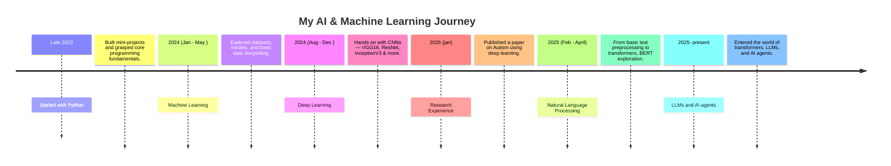

# 👋 Hey ...welcome to my verse 
<!-- Anime / AI Game Aesthetic Banner -->

  
  

<h1 align="center">I'm Priti Kumari 👩‍💻</h1>
<h3 align="center">AI/ML Enthusiast | Exploring Data, Models & Agents | Building Real-World Solutions | Joycaster ⚡</h3>

---

## 🧩 About Me

I'm on a continuous journey of learning and building in the world of **Artificial Intelligence**, **Machine Learning**, **NLP**, and **Intelligent Systems**.  
Starting with Python in 2023, I progressed from ML models to deploying deep learning solutions, and now exploring **LLMs**, **Agents**, and **AI-powered applications**.

Along the way, I’ve explored data analysis, web apps, recommendation engines, automation bots, and more — all while focusing on understanding the **why**, not just the how.

---

## 🚀 What I'm Up To

- 📌 Actively uploading projects — not all at once to keep things clean.
- 🛠️ The major, time-intensive projects from each domain will be up in 2 weeks .
- 🔄 Gradually pushing smaller, practical projects from each topic I’ve explored.

### 🧠 My Journey So Far

- **2023** — Started with Python, building small projects to understand programming fundamentals.
- **Early 2024** — Entered the world of ML with datasets, classification , regression models and hands-on data exploration through Power BI dashboards.
- **Mid-Late 2024** — Neural Network Unexpectedly immersed me in deep learning ! Explored CNNs and worked with **VGG16**, **ResNet**, **InceptionV3**, **UNet**, and **MobileNet**.
- **Early 2025** — Even had a chance to write  research paper  on Autism Spectrum Disorder using InceptionV3.
- **2025** — Inspired by OpenAI and DeepSeek, I entered **NLP & LLMs**, exploring **transformers**, **LLMs**, and now building **AI agents** using tools like LangChain and LangGraph.

I love blending science with storytelling — and I'm always ready to turn models into magic.

---

---

## 🧰 Tools & Tech Stack

  <!-- Common Languages -->
  

  <!-- Custom Icons -->
  
  
  
  

-  AI/ML: [Scikit-learn](https://scikit-learn.org/), [TensorFlow](https://www.tensorflow.org/), [Keras](https://keras.io/), [XGBoost](https://xgboost.ai/)
-  Deep Learning: CNNs, Transfer Learning (VGG16, ResNet, UNet, MobileNet, Inception)
-  Data Analysis: [Power BI](https://powerbi.microsoft.com/), [Pandas](https://pandas.pydata.org/), [Matplotlib](https://matplotlib.org/), [Seaborn](https://seaborn.pydata.org/)
-  NLP/LLMs: [Hugging Face](https://huggingface.co/), [LangChain](https://www.langchain.com/), [Transformers](https://huggingface.co/transformers/)
-  In Progress: [LangGraph](https://langgraph.dev/), Prompt Engineering, AI Agents

---

## 🎮 Projects That Power Up My XP

Over time, I've worked on various real-world and practice-based projects across data analytics, machine learning, deep learning, and AI. I'm in the process of uploading more of them regularly to avoid piling everything up at once.

The main and most time-intensive projects — those that helped me deeply understand different domains — are already uploaded below. I'm continuing to add more projects from different areas of my learning journey, one by one. 📚✨

---

### 📊 Data Analytics & Business Intelligence  
**Tools Used:** SQL · Python · Power BI

These projects helped me explore business decision-making using data. I learned how to extract, transform, and visualize data to deliver actionable insights for stakeholders.

- **[Banking-Case-Analysis](https://github.com/PriiiAiVerse/Banking-Case-Analysis)**  
  A risk analytics project to determine applicant credibility for loans using SQL, Python, and Power BI.

- **[ANALYSIS_USING_SQL](https://github.com/PriiiAiVerse/ANALYSIS_USING_SQL)**  
  Performed deep-dive sales analysis of Walmart using SQL querying and Python logic.

---

### 🤖 Machine Learning & Deep Learning  
**Tools Used:** scikit-learn · TensorFlow/Keras · VGG16 · OpenCV

I applied machine learning and deep learning to structured and image data. This phase taught me about model building, evaluation, generalization, and ethical AI considerations.

- **[Autism-Detection-in-Children](https://github.com/PriiiAiVerse/Autism-Detection-in-Children)**  
  Built a CNN model using transfer learning (VGG16) for classifying autistic vs. non-autistic children.

- **[A-B-testing](https://github.com/PriiiAiVerse/A-B-testing)**  
  Project investigates whether displaying advertisements increases user conversions using A/B testing.

-  **[Breast-Histopathology-Image-Classification](https://github.com/PriiiAiVerse/Breast-Histopathology-Image-Classification)**  
   Project is focused on building a Convolutional Neural Network (CNN) to classify breast cancer histopathology images.

 - **[Spam_classifier](https://github.com/PriiiAiVerse/Spam-Classifier/blob/main/Spam_classifier.ipynb)**  
  Project building a machine learning model to detect spam messages from SMS text data.

  - **[Sentiment-Analysis-Experiment-Using-Different-Model](https://github.com/PriiiAiVerse/Sentiment-Analysis-Experiment-Using-Different-Model)**  
  Deep Learning Project build using embeddings and Bidirectional LSTM to analyse the Sentiment of Users.

  - **[Deep-Learning-Part--2-](https://github.com/PriiiAiVerse/Deep-Learning-Part--2-)**  
  Project building a basic CNN structure to understand how each layers contibute to model.

---

### 🎬 Recommendation Systems  
**Tools Used:** scikit-learn · Streamlit · TMDb API

I built intelligent systems to understand user preferences and return personalized results using metadata and content-based filtering techniques.

- **[Movie-Recommendation-using-API](https://github.com/PriiiAiVerse/Movie-Recommendation-using-API)**  
  Recommends similar movies using metadata like cast, genre, plot, and user input. Deployed using Streamlit.

---

### 🧠 LLMs & AI Agents  
**Tools Used:** LangChain · Transformers · Mistral 7B · Gemma · Huggingface · PyMuPDF

My latest learning journey involves working with LLMs and agents. These projects taught me about Retrieval-Augmented Generation (RAG), prompt engineering, and memory-efficient model loading.

- **[LLM-RAG-Pipeline](https://github.com/PriiiAiVerse/LLM-RAG-Pipeline)**  
  PDF-based information extraction and Q&A using a Gemma LLM in a RAG-inspired setup.

- **[Agent_Style_Bot](https://github.com/PriiiAiVerse/Agent_Style_Bot)**  
  Built an intelligent agent using Mistral 7B that interacts with the web and performs user-defined tasks.

---

### 🔧 Backend & Full Stack (CRUD & APIs)  
**Tools Used:** FastAPI · MySQL · SQLAlchemy · Pydantic

In these projects, I explored the fundamentals of backend systems, from database communication to API endpoint design.

- **[FastAPI-SQL-Application](https://github.com/PriiiAiVerse/FastAPI-SQL-Application)**  
  Created a structured FastAPI CRUD backend with proper ORM, validation, and routing.

- **[Online_Bus_Booking_System](https://github.com/PriiiAiVerse/Online_Bus_Booking_System)**  
  GUI-based bus booking platform where users can search, book, and manage bookings. Admin panel included.

---

### 🗣️ Voice Assistants & Bots  
**Tools Used:** speech_recognition · pyttsx3 · Wikipedia API · pyjokes

These small yet interesting projects helped me understand how user interaction can be powered using speech and simple automations.

- **[Virtual-Assistant-Alexa](https://github.com/PriiiAiVerse/Virtual-Assistant-Alexa)**  
  A voice-based assistant that performs tasks like playing videos, telling time, fetching Wikipedia info, and cracking jokes.

---

### 🧪 Mini Python Projects & Fun Apps  
**Tools Used:** Tkinter · matplotlib · TextBlob · PyPDF2 · img2pdf · pillow · Python core libraries 

These beginner to intermediate-level mini projects were fun ways to practice Python concepts, logic building, GUI development, and error handling.

- **[Password_generator_App](https://github.com/PriiiAiVerse)** — Create strong random passwords
- **[Weight_Convertor_App](https://github.com/PriiiAiVerse)** — GUI weight conversion app
- **[Calender_App](https://github.com/PriiiAiVerse)** — Displays calendar of a given year
- **[Chess_App](https://github.com/PriiiAiVerse)** — Chessboard visualizer with a twist
- **[game](https://github.com/PriiiAiVerse)** — Rock-Paper-Scissors with GUI
- **[guess_game](https://github.com/PriiiAiVerse)** — CLI-based number guessing
- **[spelling_check](https://github.com/PriiiAiVerse)** — Spell checker using TextBlob
- **[Img-to-PDF-Convert](https://github.com/PriiiAiVerse/Img-to-PDF-Convert)**  - GUI to convert, split, and merge PDFs from images or other files.

---
*More domain-specific and exploratory projects are being uploaded every week — including projects in Machine Learning, NLP, Data Warehousing, Dashboards, and Agents.*

---

## 🎀 Fun Side of Me

  
  

- 🎮 I love anime-inspired tech themes , arts , paintings .
- 🌌 Favorite themes: futuristic tech, cyberpunk AI, and character-driven design  
- 👾 I believe in creativity & curiosity

---------

## 🌐 Connect With Me

- 💼 [LinkedIn](https://www.linkedin.com/in/priti-kumari-651107355/)
- 🧠 [Portfolio / Blog  ] ( In Progress ) (https://priiiaiverse.github.io/Resume/)
- 📧 Email: pritikumari000214@gmail.com

---

<i>“In a world full of code, I choose to build minds.”</i>

