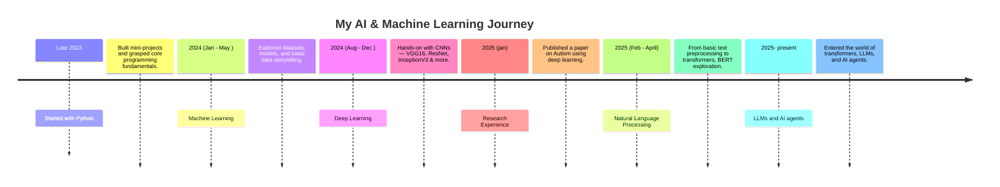

# 👋 Hey ...welcome to my verse 
<!-- Anime / AI Game Aesthetic Banner -->

  

<h1 align="center">I'm Priti Kumari 👩‍💻</h1>
<h3 align="center">AI/ML Explorer | Deep Learning Enthusiast | LLM Builder | Joycaster ⚡</h3>

---

## 👾 About Me

Hi! I'm a passionate student with a mind constantly orbiting around the world of Artificial Intelligence. My fascination began in 2023, when I picked up Python — and I haven’t looked back since.

> 🕒 Although I started uploading to GitHub recently, I’ve been working on AI/ML projects since late 2023 — focusing first on learning deeply before curating my work here.

### 🧠 My Journey So Far

- **2023** — Started with Python, building small projects to understand programming fundamentals.
- **Early 2024** — Entered the world of ML with datasets, classification , regression models and hands-on data exploration through Power BI dashboards.
- **Mid-Late 2024** — Neural Network Unexpectedly immersed me in deep learning ! Explored CNNs and worked with **VGG16**, **ResNet**, **InceptionV3**, **UNet**, and **MobileNet**.
- **Early 2025** — Even had a chance to write  research paper  on Autism Spectrum Disorder using InceptionV3.
- **2025** — Inspired by OpenAI and DeepSeek, I entered **NLP & LLMs**, exploring **transformers**, **LLMs**, and now building **AI agents** using tools like LangChain and LangGraph.

I love blending science with storytelling — and I'm always ready to turn models into magic.

---

---

## 🧰 Tools & Tech Stack

  <!-- Common Languages -->
  

  <!-- Custom Icons -->
  
  
  
  

-  AI/ML: [Scikit-learn](https://scikit-learn.org/), [TensorFlow](https://www.tensorflow.org/), [Keras](https://keras.io/), [XGBoost](https://xgboost.ai/)
-  Deep Learning: CNNs, Transfer Learning (VGG16, ResNet, UNet, MobileNet, Inception)
-  Data Analysis: [Power BI](https://powerbi.microsoft.com/), [Pandas](https://pandas.pydata.org/), [Matplotlib](https://matplotlib.org/), [Seaborn](https://seaborn.pydata.org/)
-  NLP/LLMs: [Hugging Face](https://huggingface.co/), [LangChain](https://www.langchain.com/), [Transformers](https://huggingface.co/transformers/)
-  In Progress: [LangGraph](https://langgraph.dev/), Prompt Engineering, AI Agents

---

## 🎮 Projects That Power Up My XP

|  Project |  Description |  Tools |
|-----------|----------------|---------|
|  Online Bus System | Built entirely using Python and database and gui interface | Python, Sql |
|  Image Classifier | Built deep learning pipelines using VGG16, ResNet, and MobileNet | TensorFlow, Keras |
|  Sentiment Analyzer | Text-based emotion detection using LSTM + transformers | Hugging Face, NLTK |
|  BI Dashboard | Sales and insights via dynamic Power BI reports | Power BI, DAX |
|  LLM-PDF Analyser | pipeline to extract and analyze PDF  |  LLMs + RAG, Python |

---

## 🎀 Fun Side of Me

  
  

- 🎮 I love anime-inspired tech themes , arts , paintings .
- 🌌 Favorite themes: futuristic tech, cyberpunk AI, and character-driven design  
- 👾 I believe in creativity & curiosity

---------

## 🌐 Connect With Me

- 💼 [LinkedIn](https://www.linkedin.com/in/priti-kumari-651107355/)
- 🧠 [Portfolio / Blog ( In Progress )](https://yourwebsite.com)
- 📧 Email: pritikumari000214@gmail.com

---

<i>“In a world full of code, I choose to build minds.”</i>

